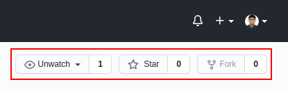

  <h3 align="center">Two-step form</h3>

  <p align="center">
    The two-step user registration form to get you registered!
    <br />
    <a href="https://therangecoder.github.io/two-step-form/"><strong>View Demo »</strong></a>
    <br />
  </p>
</p>


<!-- TABLE OF CONTENTS -->
<details open="open">
  <summary>Table of Contents</summary>
  <ol>
    <li>
      <a href="#about-the-project">About The Project</a>
      <ul>
        <li><a href="#built-with">Built With</a></li>
      </ul>
    </li>
    <li>
      <a href="#getting-started">Getting Started</a>
      <ul>
        <li><a href="#installation">Installation</a></li>
      </ul>
    </li>
    <li><a href="#license">License</a></li>
    <li><a href="#contact">Contact</a></li>
    <li><a href="#acknowledgements">Acknowledgements</a></li>
  </ol>
</details>


<!-- ABOUT THE PROJECT -->
## About The Project

It could often be a bit overwhelming to view a single-step form with several input fields in it. Well, here's a solution to that.

This 2-step form could indeed make your registration experience smoother and better!

### Built With

These are the technologies that I used to build the two-step form:
* HTML5
* CSS (Vanilla CSS and Bootstrap5)
* JavaScript


<!-- GETTING STARTED -->
## Getting Started

To get a local copy of the form, up and running on your system, follow these steps.


### Installation

1. Fork this repository
<div style="text-align:center"></div>

2. Clone the repository
   ```sh
   git clone https://github.com/[your_username]/two-step-form.git
   ```
3. Navigate into the directory
   ```sh
   cd two-step-form
   ```
4. Open the `index.html` file on your default browser or a browser of your choice
   ```sh
   xdg-open ./index.html
   ``` 


<!-- LICENSE -->
## License

The README template, used for this project, was distributed under the MIT License. See `LICENSE` for more information.


<!-- CONTACT -->
## Contact

#### Shuvadarshan Bhual
* Drop me an [email](mailto:sbhual1998@gmail.com) 
* Follow me on [Twitter](https://twitter.com/theRangeCoder)
* Let us connect on [LinkedIn](https://www.linkedin.com/in/shuvadarshan-bhual)


<!-- ACKNOWLEDGEMENTS -->
## Acknowledgements
* [Othneil Drew](https://www.othneildrew.com) for the [README template](https://github.com/othneildrew/Best-README-Template)
